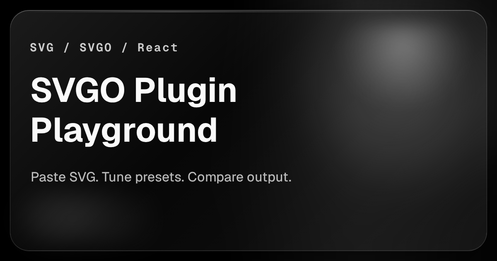

# svgo-plugins

<p align="center">
  <a href="https://wiyco.github.io/svgo-plugins/">
    
  </a>
</p>

<p align="center">
  <a href="https://github.com/wiyco/svgo-plugins/actions/workflows/ci.yml">
    
  </a>
  <a href="https://wiyco.github.io/svgo-plugins/">
    
  </a>
  <a href="https://www.npmjs.com/package/@wiyco/svgo-plugin-hoist-stroke-width">
    
  </a>
  <a href="https://bundlephobia.com/package/@wiyco/svgo-plugin-hoist-stroke-width">
    
  </a>
  <a href="./LICENSE">
    
  </a>
  <br />
  <a href="./docs/assets/coverage.svg">
    
  </a>
  <a href="./docs/assets/code-to-test-ratio.svg">
    
  </a>
  <a href="./package.json">
    
  </a>
  <a href="./pnpm-lock.yaml">
    
  </a>
  <a href="./package.json">
    
  </a>
</p>

A workspace for SVGO plugins aimed at SVG-to-React workflows.

## Package

- [`svgo-plugin-hoist-stroke-width`](packages/svgo-plugin-hoist-stroke-width) (`@wiyco/svgo-plugin-hoist-stroke-width`)

See the package README for the public API and usage examples.

## Workspace

```text
.
├─ scripts/
├─ packages/
│  └─ svgo-plugin-hoist-stroke-width/
│     ├─ src/
│     └─ __tests__/
└─ apps/
   └─ playground/
      ├─ index.html
      ├─ svgo-plugin-hoist-stroke-width/
      │  └─ index.html
      ├─ src/
      │  ├─ entries/
      │  ├─ core/
      │  ├─ landing/
      │  └─ playgrounds/
      │     └─ svgo-plugin-hoist-stroke-width/
      └─ public/
```

`apps/playground` is a single Vite app. Each package playground lives under `src/playgrounds/<slug>`, while the published GitHub Pages URL stays slug-based at `/<slug>/` via a dedicated nested `index.html`.

## Tooling

Type-checking runs on TypeScript 7 beta through `tsgo` from `@typescript/native-preview`. Each workspace app/package uses `typecheck` for `tsgo` and `typecheck:tsc` as the TypeScript 6 fallback. Build tooling still keeps `typescript` 6.x installed side-by-side because the stable TypeScript 7 programmatic API is not available yet.
